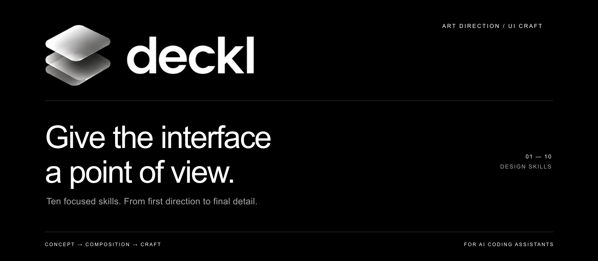

<p align="center">
  
</p>

# Deckl

**Art direction and UI craft for AI coding assistants.**

Turn a brief or existing interface into distinctive, coherent, professionally finished work. Deckl favors modern, minimal, premium design grounded in the product—not a repeating collection of fashionable effects. Your brand and explicit requirements always come first.

[Quick start](#quick-start) · [Skills](#skills) · [Workflows](#workflows) · [Installation](#installation) · [FAQ](#faq)

> **Local development preview.** Ten skills and a local installer are included. Deckl is not published to npm. Installation logic is tested; live assistant behavior and design effectiveness still need evaluation.

## Start here

| Your task | Start with |
| --- | --- |
| Make an existing interface better | [deckl-refine](skills/deckl-refine/SKILL.md) |
| Build or substantially redesign a website | [deckl-design](skills/deckl-design/SKILL.md) |
| Find what needs improvement before editing | [deckl-audit](skills/deckl-audit/SKILL.md) |
| Decide what the website should feel like | [deckl-direct](skills/deckl-direct/SKILL.md) |

Choose the skill that matches the job. You do not need to run all ten.

## Quick start

You need this folder, **Node.js 22+**, and an assistant that supports local skills. Open the Deckl folder in VS Code and run these commands in its terminal, from the folder containing this README.

### Claude Code

Preview the destination, then install the starter skill for your user:

```sh
node scripts/install.mjs --agent claude --scope user --skill deckl-refine --dry-run
node scripts/install.mjs --agent claude --scope user --skill deckl-refine
```

Open your website project in Claude Code, refresh the session if needed, and enter:

```text
/deckl-refine Improve this website's hierarchy, typography, and spacing. Keep its brand, content, and working controls.
```

### Codex

```sh
node scripts/install.mjs --agent codex --scope user --skill deckl-refine --dry-run
node scripts/install.mjs --agent codex --scope user --skill deckl-refine
```

Open your website project in Codex, refresh the session if needed, and enter:

```text
$deckl-refine Improve this website's hierarchy, typography, and spacing. Keep its brand, content, and working controls.
```

Claude Code uses `/deckl-refine`. Codex uses `$deckl-refine`, or its skill picker where available. Copying files does not confirm that a host has discovered them; see [troubleshooting](#faq).

## Skills

The names below link to the actual instructions. Use `/` before a name in Claude Code and `$` in Codex.

### Direction and design

| Skill | When to use it | Result |
| --- | --- | --- |
| [deckl-direct](skills/deckl-direct/SKILL.md) | A campaign, studio, or product needs a clear visual idea. | Art direction and an actionable brief; no UI edits by default. |
| [deckl-design](skills/deckl-design/SKILL.md) | A new site or substantial redesign needs a coherent concept. | An implemented page or site within the requested scope. |
| [deckl-refine](skills/deckl-refine/SKILL.md) | An existing interface feels generic or unresolved. | Coordinated improvements while preserving its identity and behavior. |

### Focused craft

| Skill | When to use it | Result |
| --- | --- | --- |
| [deckl-type](skills/deckl-type/SKILL.md) | Type hierarchy, wrapping, or readability feels weak. | Clear type roles, better measure, and considered font handling. |
| [deckl-layout](skills/deckl-layout/SKILL.md) | Sections repeat or composition and spacing lack intention. | Stronger grouping, page rhythm, and responsive structure. |
| [deckl-imagery](skills/deckl-imagery/SKILL.md) | Visuals feel generic or poorly integrated. | Asset direction, selection, crops, and media treatment. |
| [deckl-motion](skills/deckl-motion/SKILL.md) | An interaction needs expression or an animation needs repair. | Purposeful motion with cleanup and usable fallbacks. |
| [deckl-adapt](skills/deckl-adapt/SKILL.md) | A desktop design breaks down on small screens or touch. | Deliberate mobile composition and functioning interactions. |

### Review and finish

| Skill | When to use it | Result |
| --- | --- | --- |
| [deckl-polish](skills/deckl-polish/SKILL.md) | An established design is nearly ready for handoff. | Bounded corrections to details, consistency, and interaction states. |
| [deckl-audit](skills/deckl-audit/SKILL.md) | You want a professional critique before making changes. | Prioritized, evidence-backed findings; read-only by default. |

## What makes it Deckl

- **A real idea.** Derive the design from the product, audience, and content.
- **Clear composition.** Use hierarchy, proportion, whitespace, and rhythm deliberately.
- **Specific content.** Work with meaningful imagery and truthful copy; never invent social proof.
- **Consistent craft.** Establish type roles, spacing relationships, and reusable details.
- **Useful expression.** Let motion and visual effects support meaning and interaction.
- **A complete finish.** Account for small screens, keyboard use, reduced motion, and edge states.

Premium does not mean tiny text, empty screens, or animation everywhere. Deckl does not mandate a palette, font, framework, or page template. A dashboard should still work like a dashboard.

## Workflows

**New brand website:** `deckl-direct → deckl-design → deckl-polish`

**Existing website:** `deckl-audit → deckl-refine`, then use a specialist only when needed.

**Client handoff:** `deckl-adapt → deckl-polish → deckl-audit`

These are suggested sequences, not automatic pipelines. Run each step with the context and scope it needs.

```text
/deckl-direct Define an editorial direction for an independent architecture studio. Use the supplied projects and photography. Deliver a brief only.
```

```text
/deckl-motion Improve the project gallery's transitions. Preserve keyboard navigation, support touch, and provide a reduced-motion alternative.
```

```text
/deckl-audit Review the checkout before handoff. Prioritize usability and responsive failures. Do not modify files.
```

In Codex, replace the leading `/` with `$`. See [professional workflows and detailed prompts](workflows.md).

## Installation

### Install every skill

For a fresh installation, omit `--skill`. Choose the assistant you use:

```sh
node scripts/install.mjs --agent claude --scope user
```

```sh
node scripts/install.mjs --agent codex --scope user
```

If you already installed the starter skill, an all-skills install will stop because that folder exists. Select the additional skills explicitly, or follow the update instructions below.

### Select several skills

Repeat `--skill`:

```sh
node scripts/install.mjs --agent claude --scope user --skill deckl-design --skill deckl-type --skill deckl-motion
```

### Install for one project

Use an existing website directory as `--project`. Quote paths containing spaces. This preview uses `.` and therefore targets the current Deckl checkout; replace it with your website's path before using it there.

```sh
node scripts/install.mjs --agent claude --scope project --project . --skill deckl-refine --dry-run
```

Check the printed destination, then repeat your chosen command without `--dry-run`. Use `--agent codex` for Codex.

### Inspect available options

```sh
node scripts/install.mjs --list
node scripts/install.mjs --help
```

The helper runs locally, uses no dependencies or network, and checks all selected destinations before copying. It refuses existing skill folders and symlink discovery directories. There is no overwrite or force option.

### Manual installation

Copy the **entire** wanted folder from `skills/`, including its references. For example:

| Assistant | User destination | Project destination |
| --- | --- | --- |
| Claude Code | `~/.claude/skills/deckl-refine/` | `.claude/skills/deckl-refine/` |
| Codex | `~/.agents/skills/deckl-refine/` | `.agents/skills/deckl-refine/` |

The final structure must contain `deckl-refine/SKILL.md`, not just a loose Markdown file. `~` means your home directory; project paths are relative to your website. For remote or container sessions, install in the environment running the assistant. Other compatible assistants may also discover `.agents/skills`; avoid duplicate installations in directories a host reads.

Host documentation: [Claude Code skills](https://code.claude.com/docs/en/skills) · [Codex skills](https://learn.chatgpt.com/docs/build-skills) · [Agent Skills specification](https://agentskills.io/specification).

### Update or remove

Compare the installed folder with the new source first. Preserve your edits by backing up the exact installed skill folder **outside all skill discovery directories**, then move the installed folder aside and rerun the installer for that skill. Automatic merging is not provided.

To uninstall, remove only the specific Deckl skill folder you installed after preserving local edits. Refresh the assistant afterward. Do not remove the parent skills directory: it may contain other people's skills.

## FAQ

<details>
<summary><strong>Is this similar to Taste Skill?</strong></summary>

Yes. Both use portable skill instructions to improve AI-generated interfaces. Deckl is organized around ten professional tasks, from direction through handoff. This is a workflow distinction, not a proven quality advantage. Read the [comparison and attribution](docs/comparison.md) and visit [Taste Skill](https://github.com/leonxlnx/taste-skill).

</details>

<details>
<summary><strong>Can I install Deckl globally with npm?</strong></summary>

Not yet. There is no published or verified Deckl npm package in this project. Use the included local helper. A global npm command can be added once the package identity, license, release process, and installer behavior are ready.

</details>

<details>
<summary><strong>Does it work in every AI IDE?</strong></summary>

The skills use portable Markdown and have no required host-specific tools. The installer currently targets Claude Code and Codex directories only. Other Agent Skills-compatible assistants may load them, but each host's discovery, command syntax, and behavior needs separate testing. End-to-end host validation is pending.

</details>

<details>
<summary><strong>Does it include an AI model, browser, or image generator?</strong></summary>

No. The assistant uses tools available in its own environment. Image generation and browser inspection depend on that environment and may carry its normal costs. The skills require honest reporting when a check or capability is unavailable.

</details>

<details>
<summary><strong>Will it produce an Awwwards-winning website?</strong></summary>

That level of craft is an aspiration, not a guaranteed result. Quality depends on the brief, assets, model, implementation, and review. Deckl is not affiliated with Awwwards.

</details>

<details>
<summary><strong>The skill does not appear. What should I check?</strong></summary>

Check the exact folder hierarchy, the environment running your assistant, and its current discovery settings. Refresh or restart the session. Use `/deckl-refine` in Claude Code and `$deckl-refine` in Codex, or the host's skill picker. Check for duplicate versions. Installer success means files were copied; it does not confirm host discovery.

</details>

<details>
<summary><strong>The installer reports an existing destination.</strong></summary>

It stopped to preserve existing files. Compare that folder with the source, back up any edits outside discovery directories, and move the old folder aside before retrying. If you only want new skills, select them explicitly with repeated `--skill` options.

</details>

## Edit and verify

Open this folder in VS Code. Each command's instructions live in `skills/<name>/SKILL.md`. Keep the folder name and YAML `name` identical, and keep references inside their owning skill.

Run the installer checks from this folder:

```sh
node --test tests/install.test.mjs
```

The tests use temporary directories and cover selected installs, complete project installs, dry runs, conflicts, invalid inputs, repeat installs, and symlink rejection. They do not test the quality of generated designs or live assistant discovery.

Use [evaluation.md](evaluation.md) for behavioral testing and [CONTRIBUTING.md](CONTRIBUTING.md) for changes.

```text
deckl/
├── README.md
├── workflows.md
├── evaluation.md
├── CONTRIBUTING.md
├── CHANGELOG.md
├── assets/deckl-banner.png
├── assets/deckl-logo.png
├── docs/comparison.md
├── scripts/install.mjs
├── tests/install.test.mjs
└── skills/
    └── deckl-*/SKILL.md  (+ references where needed)
```

## Project status

**Included:** ten skills, supporting references, workflow examples, a local installer, installer tests, and an evaluation protocol.

**Before public release:** evaluate real design outputs, verify discovery and invocation in each advertised host, choose a distribution license, and prepare npm packaging if desired. See [the changelog](CHANGELOG.md).

No license has been selected yet; this project does not currently assert an open-source license grant. Package, domain, and trademark availability for “Deckl” have not been verified.
